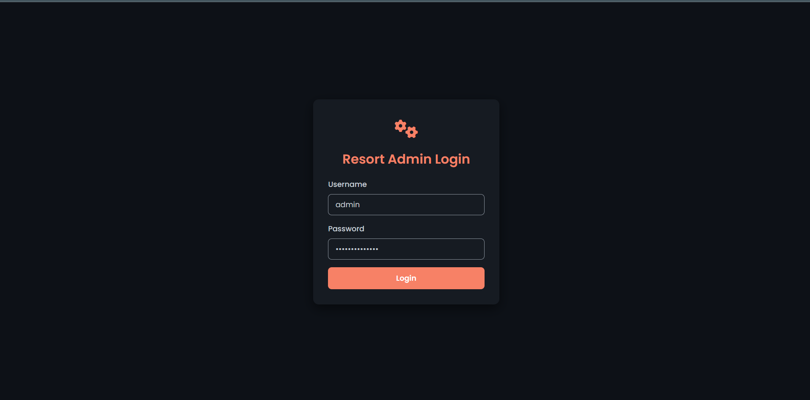
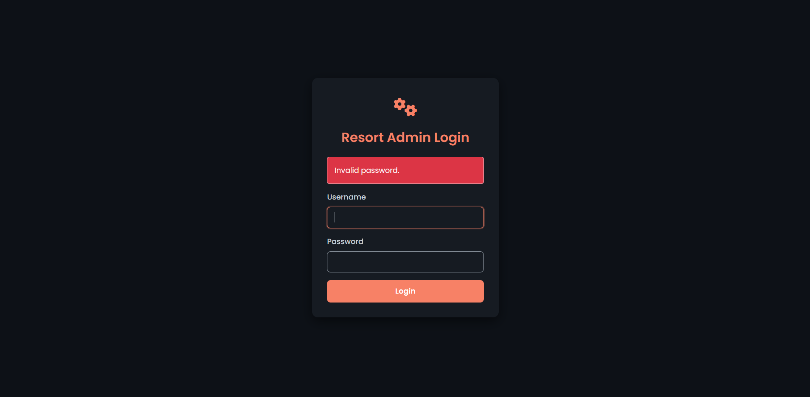
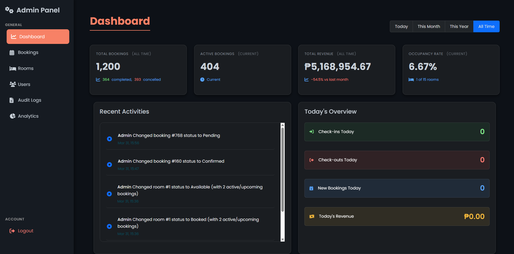
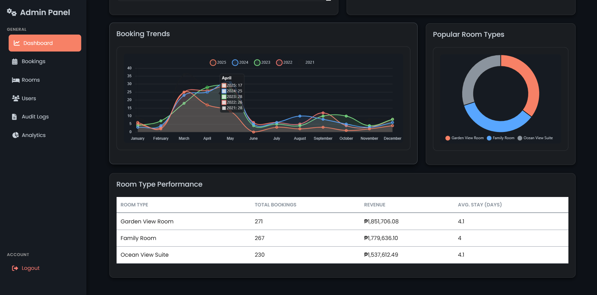
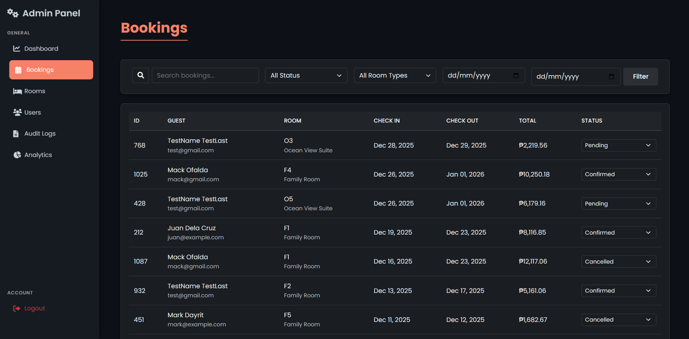
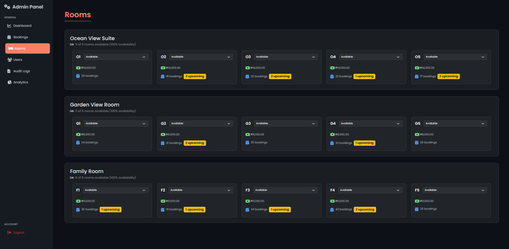
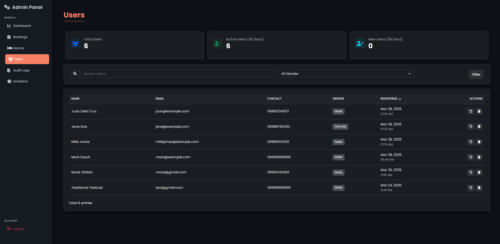
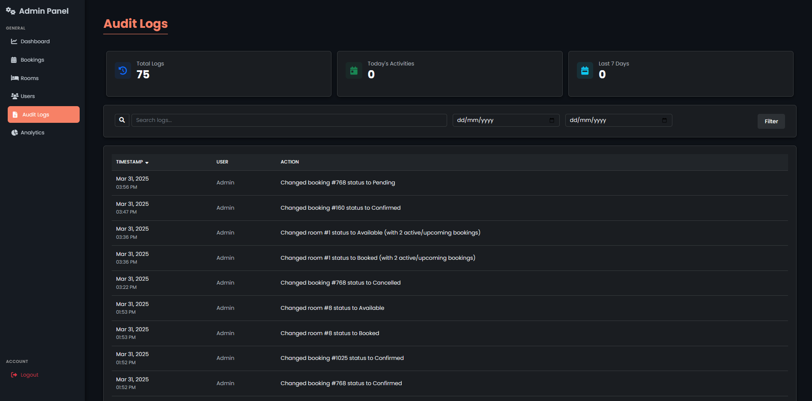
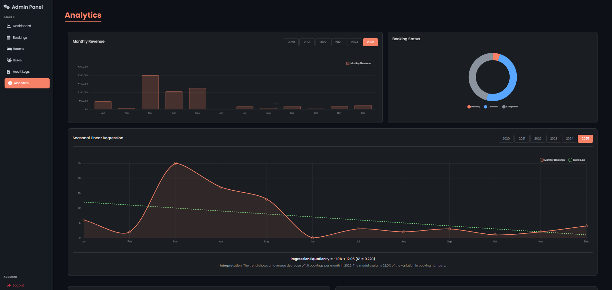
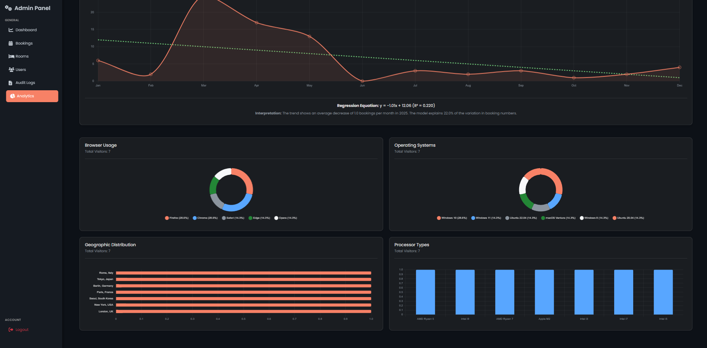

# Resort Admin Panel

A modern, responsive admin dashboard for managing resort/hotel bookings, rooms, users, analytics, and audit logs. Built with PHP, MySQL, Bootstrap, and Chart.js, featuring a clean dark theme and interactive data visualizations.

---

## Features

- **Dashboard**: Overview of bookings, revenue, occupancy, and trends.
- **Bookings**: Manage, filter, and update guest bookings.
- **Rooms**: View and manage room types, availability, and rates.
- **Users**: Manage registered users and their activity.
- **Audit Logs**: Track admin/user actions for security and transparency.
- **Analytics**: Visualize trends, guest demographics, and system usage.
- **Authentication**: Secure admin login/logout.
- **Responsive Design**: Works on desktop and mobile.

---

## Screenshots

### Login

### Dashboard

### Bookings

### Rooms

### Users

### Audit Logs

### Analytics

---

## Getting Started

### Prerequisites

- PHP 8.x
- MySQL/MariaDB
- Apache/Nginx (or use XAMPP/WAMP/MAMP for local development)

## Technologies

- **Frontend:** HTML, CSS, JavaScript, Bootstrap, Chart.js
- **Backend:** PHP, Laravel
- **Database:** MySQL/MariaDB
- **Server:** Apache/Nginx

